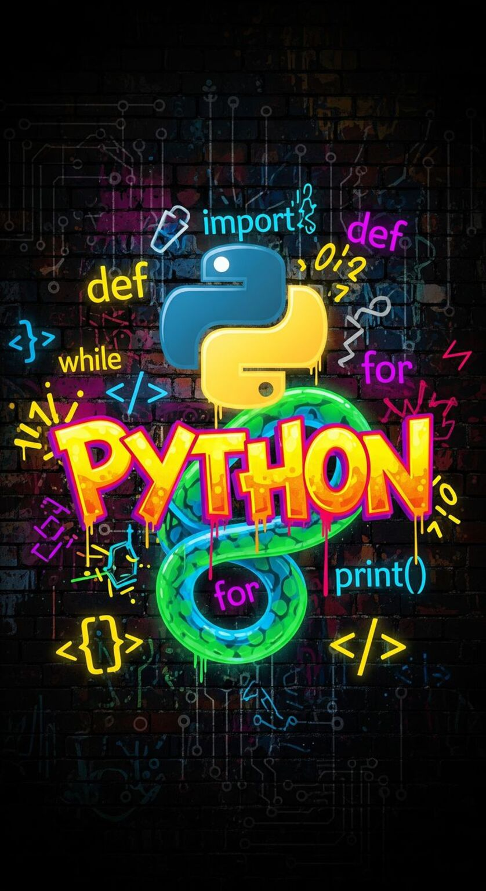

# AutomationTestingPy



Проект автоматизированного тестирования на Python, включающий:

- API тестирование
- E2E UI тестирование

Реализован с использованием современных инструментов автоматизации и отчетности.

## 🧩 Описание каталогов

### 📡 apiTesting

Каталог содержит автотесты для тестирования REST API.

Используемые библиотеки:

- `requests` — выполнение HTTP-запросов
- `pytest` — тестовый фреймворк
- `jsonschema` — валидация JSON-ответов по схеме
- `allure-pytest` — формирование отчётов

Реализовано:

- Проверка статус-кодов
- Проверка структуры ответа
- Валидация схемы JSON
- Проверка бизнес-логики API
- Интеграция с Allure Report

### 🗺️ e2eTesting

Каталог содержит end-to-end UI тесты.

Используемые библиотеки:

- `pytest` — тестовый фреймворк
- `selenium` — управление браузером
- `webdriver_manager` — автоматическое управление драйверами
- `allure-pytest` — формирование отчётов

Реализовано:

- UI взаимодействия
- Проверка пользовательских сценариев
- Работа с элементами страницы
- Интеграция с Allure Report
- Применение Фикстуры в `conftest.py`

#### 📝 Тест-кейсы (UI)

##### Позитивный сценарий: Успешная отправка формы SimbirSoft
1. **Шаги:**
   - Открыть страницу формы.
   - Заполнить все поля валидными данными.
   - Выбрать напитки: *Milk, Coffee*.
   - Выбрать цвет: *Yellow*.
   - Сформировать сообщение автоматически.
   - Нажать **Submit**.
2. **Ожидаемый результат:** Появляется alert с текстом `Message received!`.

##### Негативный сценарий: Отправка формы без email
1. **Шаги:**
   - Заполнить все поля, кроме поля **Email**.
   - Нажать **Submit**.
2. **Ожидаемый результат:** Alert **не появляется**, форма не отправляется, данные остаются в полях. Обработал данную Ситуацию через `page.verify_alert(should_be_present=False)` и `try:` В связке с `except NoAlertPresentException`

## 🔷 🛡️ 🟡 Виртуальное окружение

В обоих каталогов для изоляции зависимостей используется отдельное виртуальное окружение.

### 📦 🐧 Установка модуля venv (Linux)

```bash
sudo apt install python3-venv
```

### 🧊 Создание виртуального окружения

```bash
python3 -m venv env
```

Виртуальное окружение также может быть создано автоматически средствами **Visual Studio Code.**

### ⚡ Активация окружения

#### 🐧 Linux / macOS

```bash
source .venv/bin/activate
```

#### 🪟 Windows

```bash
.venv\Scripts\activate || bat файл
```

### 🚫 Деактивация окружения

```bash
deactivate
```

Использование виртуального окружения позволяет изолировать зависимости проекта и избежать конфликтов между различными версиями библиотек.

## 📥 Установка зависимостей проекта и pip на Linux

```bash
sudo apt install build-essential
python --version
python3 --version
whereis python
whereis python3
whereis pip
whereis pip3
which pip
which pip3
which python
which python3
sudo apt update
sudo apt install python3-pip
sudo pip3 install --upgrade pip
pip show
pip list
```

```bash
cd test_type_folder
pip install -r static/libs.txt
```

## ⏩ Запуск тестов

### 🔌 API тесты

```bash
cd apiTesting
pytest
```

### 📸 E2E тесты

```bash
cd e2eTesting
pytest
```

## 📊 Генерация Allure отчёта в корневом каталоге родителя

```bash
pytest --alluredir=coverage
./allure-2.35.1/bin/allure serve ./e2eTesting/coverage
```

## 🎯 Цель проекта

- Демонстрация навыков автоматизации тестирования

- Разделение API и UI тестирования

- Использование best practices pytest

- Работа с отчетностью Allure

- Практика построения тестовой архитектуры

## 📈 Возможные расширения

- Поддержка нагрузочного тестирования
- Параллельный запуск тестов
- CI/CD интеграция
- Docker контейнеризация
- Page Object Model для E2E
- Логирование и кастомные хуки pytest

---

© 2026 AutomationTestingPython. Все права защищены.
